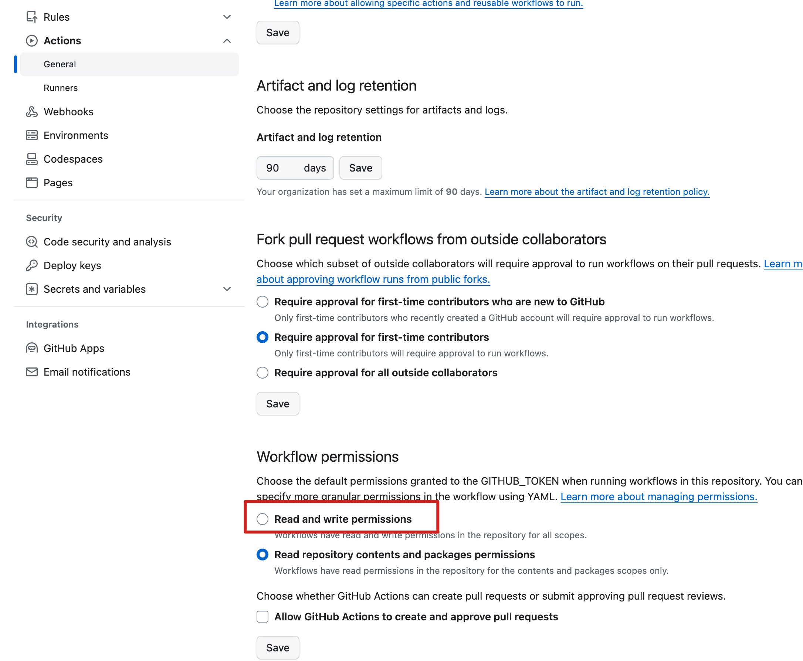

# Node coverage report

[](https://github.com/huk10/node-coverage-report/blob/master/LICENSE)
[](https://github.com/huk10/node-coverage-report/releases)

一个 Github Action 用于生成一个含有测试覆盖率的[徽标][badge]，并将它添加到你的 JavaScript
代码仓库中。部分代码来自于 [go-coverage-report](https://github.com/ncruces/go-coverage-report)。

[English](./README.md) | [简体中文](./README-zh-Hans.md)

## How works

目前，主流的 JavaScript 测试框架应该都是使用 [istanbul.js][istanbul] 生成的测试覆盖率报告（v8 也支持 istanbul.js）。
这个 Action 会尝试读取 `text-summary`、`json-summary` 这两个 reporters
的输出从中解析出测试覆盖率，然后使用 [shields.io][shields] 生成一个徽标，它将这个徽标上传到你代码仓库的 wiki 之中。

其核心是需要你的项目能够输出符合这两个 reporters (`text-summary` 、`json-summary`) 格式的报告。

因为 `text-summary` 的输出只存在于命令行之上，而 `json-summary` 可以提前生成于文件目录之中。为了避免重复执行测试命令。
内部将会优先读取 `json-summary` 内容。取不到时再运行命令生成数据。

对于 vitest 和 jest 它们都有 reporters 的配置项，其他的测试框架如果可以配合 [nyc][nyc] 使用的话，那么应该也能支持。

## Usage

首先你的代码仓库需要至少有一个 wiki 页面，然后还需要开启 Action 对仓库的读写权限。

<details>
    <summary>查看图片</summary>
    <div align=center>
        
    </div>
</details>

接下来需要将下面代码添加到你的 Github workflows 之中。

```yaml
- name: Update coverage report
  uses: huk10/node-coverage-report@v1
```

这个 Action 有 6 个可选的配置项:

- **command** 它应该是一个能够输出上述 reporters 内容的命令。默认是：`npm run test:coverage`
- **coverage-dir** 测试覆盖率报告文件的输出目录。默认是：`coverage`
- **output-dir** 这个 Action 在你代码仓库的 wiki 中输出文件的目录，默认在根目录输出。
- **badge-style** [shields.io][shields] 的徽标风格样式，只能是 `flat`, `flat-square`, `plastic`, `for-the-badge`
  , `social` 之一。默认是 `flat`
- **badge-title** 徽标上面的文本，默认是：`coverage`
- **amend** 在向 wiki 仓库提交时使用可以避免生成太多的 `Update coverage` commit，默认是：`false`

> Also, consider:
> - running this step _after_ your tests run
>   - coverage will fail if any test fails, so you may skip it if they fail
> - running it only once per commit
>   - use a condition to avoid repeated matrix runs
> - skipping it for PRs
>   - PRs lack permission to update the Wiki, nor would you want not submitted PRs to do so
> - allowing it to fail without failing the entire job
>   - if tests pass, the problem might be with the action itself, not your code

<details>
<summary>一个完整示例:</summary>

```yaml
name: Node.js

on: [ push ]

jobs:
  build:
    runs-on: ubuntu-latest
    strategy:
      matrix:
        node-version: [ 20 ]
    steps:
      - uses: actions/checkout@v4
      - uses: pnpm/action-setup@v3
        with:
          version: 8
      - uses: actions/setup-node@v4
        with:
          node-version: ${{ matrix.node-version }}
          cache: 'pnpm'
      - name: Install dependencies
        run: pnpm install
      - name: Update coverage badge
        uses: huk10/node-coverage-report@v1
        with:
          amend: true
        if: |
          github.event_name == 'push'
        continue-on-error: true
```

</details>

如果你需要在你的 `README.md` 文件中添加徽标，可以使用下面的 Markdown 代码：

```markdown
<!-- 需要将下面的 USER 和 REPO 替换为你自己的 -->

```

## License

The scripts and documentation in this project are released under the [MIT License](./LICENSE)

[badge]: https://github.com/huk10/esdi/wiki/coverage.svg

[istanbul]: https://istanbul.js.org/docs/advanced/alternative-reporters

[shields]: https://shields.io

[nyc]: https://github.com/istanbuljs/nyc
